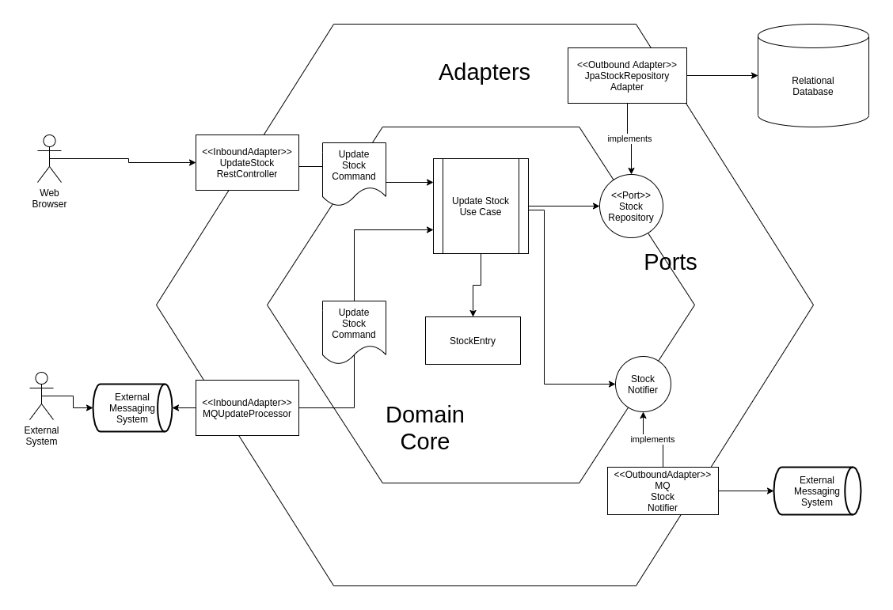

# Hexagonal Architecture Evaluation

[](https://github.com/cbuschka/hexarch-eval)

### An Example Implementation of Hexagonal Architecture Style with Spring JPA

## Prerequisites

* java 11
* maven

## Build

```
mvn verify
```

## Overview


## Packages

* [...domain](./domain/src/main/java/com/github/cbuschka/hexarch_eval/domain/) - the core domain logic
* [...inbound](./webapp/src/main/java/com/github/cbuschka/hexarch_eval/inbound/) - inbound adapters (alias primary
  actors or drivers): a web controller and a mq subscriber
* [...outbound](./webapp/src/main/java/com/github/cbuschka/hexarch_eval/outbound/) - outbound adapters (alias secondary
  actors, or drivens): a jpa repository and a mq publisher
* [...config](./webapp/src/main/java/com/github/cbuschka/hexarch_eval/config/) - spring plumbing

## Documentation

* [Questions and Answers](./doc/questions_and_answers.md)
* [References](./doc/references.md)

## License

[MIT](./license.txt)
